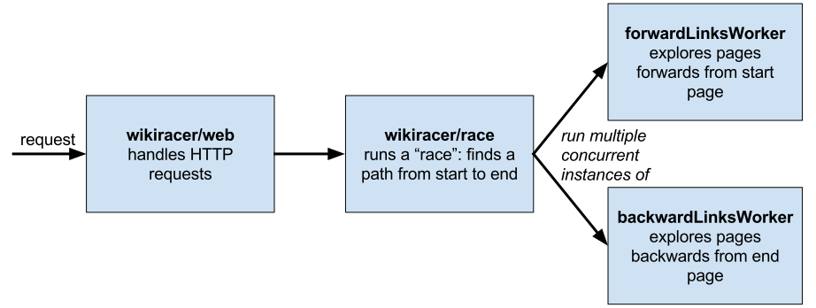

wikiracer
=========

wikiracer is a Go application which plays ["The Wikipedia Game"](https://en.wikipedia.org/wiki/Wikiracing). It takes a start page and an end page and follows hyperlinks to get from the start page to the end page as quickly as possible.

_Note: The original version of wikiracer can be found on [branch v1](https://github.com/sandlerben/wikiracer/tree/v1)._

Table of Contents
=================

   * [Basic Usage](#basic-usage)
      * [Customizing behavior](#customizing-behavior)
   * [Installation](#installation)
   * [Run tests](#run-tests)
   * [Profiling](#profiling)
   * [Why Go?](#why-go)
   * [Architecture overview](#architecture-overview)
      * [Web](#web)
      * [Race](#race)
         * [Concurrent graph traversal](#concurrent-graph-traversal)
         * [More details](#more-details)
   * [Some strategies attempted](#some-strategies-attempted)
   * [Time spent on project](#time-spent-on-project)
   * [Appendix](#appendix)

# Basic Usage

Start a wikiracer server on port `8000`.

```
$ wikiracer
INFO[0000] Server is running at http://localhost:8000
```

In order to initiate a race, make a `GET` request to the server's `/race` endpoint with the following arguments.

- starttitle **(required)**: The Wikipedia page to start from.
- endtitle **(required)**: The Wikipedia page to find a path to.
- nocache: By default, the server caches all paths previously found. To ignore the cache for this race, set `nocache=1`.

The endpoint returns a JSON response containing a path from the start page to the end page and how long it took to find the path.

```json
{
    "path": [
        "English language",
        "International Phonetic Alphabet",
        "University of Pennsylvania"
    ],
    "time_taken": "72.815763ms"
}
```

If no path was found in the time limit (see below), the JSON response will look like:

```json
{
    "message": "no path found within 1m0s",
    "path": [],
    "time_taken": "1m0s"
}
```

## Customizing behavior

The following environment variables can be used to customize the behavior of wikiracer.

- `WIKIRACER_PORT`: The port on which to run a HTTP server (default `8000`).
- `EXPLORE_ALL_LINKS`: Sometimes, the MediaWiki API doesn't return all links in once response. As a result, wikiracer continues to query the MediaWiki API until all the links are returned. If `EXPLORE_ALL_LINKS` is set to `"false"`, then wikiracer will not continue even if there are more links.
- `EXPLORE_ONLY_ARTICLES`: By default, the wikiracer only searches the main Wikipedia namespace, which includes all encyclopedia articles, lists, disambiguation pages, and encyclopedia redirects. If `EXPLORE_ONLY_ARTICLES` is set to `"false"`, then wikiracer will explore all Wikipedia namespaces. (Read more about namespaces [here](https://en.wikipedia.org/wiki/Wikipedia:Namespace).)
- `WIKIRACER_TIME_LIMIT`: The time limit for the race, after which wikiracer gives up. Must be a string which can be understood by [time.ParseDuration](https://golang.org/pkg/time/#ParseDuration) (default `1m`).
- `NUM_FORWARD_LINKS_ROUTINES`: The number of concurrent getLinks workers to run (default 15).
- `NUM_BACKWARD_LINKS_ROUTINES`: The number of concurrent getLinks workers to run (default 15).

# Installation

Create a directory and clone the repo:

```
$ mkdir -p $GOPATH/src/github.com/sandlerben/wikiracer
$ cd $GOPATH/src/github.com/sandlerben/wikiracer
$ git clone https://github.com/sandlerben/wikiracer.git .
```

Install the dependencies using [dep](https://github.com/golang/dep), the semi-official Go dependency management tool.

```
$ dep ensure
```

Finally, install wikiracer.

```
$ go install
```

# Run tests

The full test suite can be run with:

```
$ go test ./...
```

# Profiling

wikiracer exposes a [pprof endpoint](https://blog.golang.org/profiling-go-programs) which allows it to be profiled in a few ways:

- Using [go-torch](https://github.com/uber/go-torch), which can generate a [flamegraph](https://github.com/uber/go-torch#example-flame-graph) visualizing the program's workload. (Side note: I wrote this tool!)
- Using `go tool pprof`, which can create CPU profiles, memory profiles, and blocking profiles and visualize each in various different ways.

# Why Go?

I wrote this application in Go for a few reasons:

- I have experience using Go in the past from [go-torch](https://github.com/uber/go-torch) and [transcribe4all](https://github.com/hack4impact/transcribe4all).
- Go has extremely powerful concurrency primitives ([goroutines](https://gobyexample.com/goroutines) and [channels](https://tour.golang.org/concurrency/2)) and an excellent runtime/scheduler which make writing fast, thread-safe concurrent programs more straightforward than other languages.
- Go has a great standard library. In particular, it's easy to create a full-featured HTTP server and make HTTP requests using Go's built-ins.

# Architecture overview

[](./wikiracer_overview.svg)

## Web

The `wikiracer/web` package encapsulates the logic for handling HTTP requests. The package exposes two endpoints:

- `/race` returns a path from a start page to an end page.
- `/health` returns a message indicating that the server is alive and healthy.

The `wikiracer/web` package uses the `gorilla/mux` router, an extremely popular Go URL dispatcher.

The `wikiracer/web` package also features a simple cache of paths previously found (implemented as a Go map). That way, a path from same start to some end page only needs to be found once.

## Race

The `wikiracer/race` package encapsulates the Wikipedia exploring logic; it is the most interesting part of the application.

A `race.Racer` encapsulates all the state needed for one race, including:

- The page to start at
- The page to find a path to
- A record of how pages found traversing from the start page were reached during the race
- A record of how pages found traversing backwards from the end page were reached during the race
- Synchronization primitives (`sync.Once`)
- Channels to allow concurrent workers to communicate  
- A `meetingPoint` (which can be used to compute a full path as will be described below)
- Any errors that occurred during the race

A `race.Racer` exposes one public function, `Run`, which returns a path from a start page to an end page.

Under the hood, there is a lot going on inside the `race` package. Specifically, a number of `forwardLinks` workers and `backwardLinks` workers concurrently explore the graph of Wikipedia pages until a path to the end page is found.

At a high level, the Wikipedia graph is explored in the following manner:

1. The start page is added to the `forwardLinks` channel and the end page is added to the `backwardLinks` channel.
2. `forwardLinks` workers traverse the Wikipedia graph _forward_ from the start page. At each iteration, they read a page from the `forwardLinks` channel and call the MediaWiki API to add all pages linked _from_ that page to the channel. In other words, they traverse the start page's [connected component](http://mathworld.wolfram.com/WeaklyConnectedComponent.html) (technically, weakly connected component since the graph is directed).
3. `backwardLinks` workers traverse the Wikipedia graph _backward_ from the end page. At each iteration, they read a page from the `backwardLinks` channel and call the MediaWiki API to add all pages which link _to_ that page to the channel. In other words, they traverse the end page's connected component.

These stages are described in more detail below.

### Concurrent graph traversal

Clearly, the `forwardLinks` and `backwardLinks` workers are quite similar (and much of the code is shared between them). `forwardLinks` workers explore the start page's connected component and `backwardLinks` explore the end page's connected component. The main differences between the workers are the requests each make to the MediaWiki API. For `forwardLinks` the `links` property is queried; for `backwardLinks` the `linkshere` property is queried.

These workers execute as follows:

1. Iterate until the `done` channel is closed (this is a signal that all workers should exit).
2. At each iteration, take a page from the worker's channel. Query for the page's `links` or `linkshere` (which are essentially the page's "neighbors").
3. Check if any of these "neighbors" crosses [the cut](https://en.wikipedia.org/wiki/Cut_(graph_theory)) between the start page's connected component and the end page's connected component. If they do, save this `meetingPoint` and close the `done` channel to signal that an answer was found.
4. If not, map these neighbors to the original page in the relevant mapping (`pathFromStartMap` for `forwardLinks` and `pathFromEndMap` for `backwardLinks`). These maps are used to recreate a path from start to end when a `meetingPoint` is found.
5. Eventually, after some time limit (1 minute by default) if no path is found, all workers give up.

### More details

Lots more fun technical implementation details can be found in the [appendix below](#appendix).

# Some strategies attempted

### checkLinks and getLinks workers

The original version of wikiracer worked quite differently and it is fully described [here](https://github.com/sandlerben/wikiracer/blob/v1/README.md#race).

At a high level, the old implementation worked as follows. Pages passed through a two-stage pipeline:

- A page was added to the checkLinks channel. A checkLinks worker checked if the page connected to the end page using the `pltitles` parameter of the MediaWiki API. If it did, wikiracer returned. If it did not, the page was added to the getLinks channel.
- A getLinks worker took the page and added all the "neighbor" pages linked from the page to the checkLinks channel.

While this approach worked for most cases, it performed poorly when few pages linked to the end page. For example, with an end page like "Segment", which is a disambiguation page linked to by maybe about a dozen other pages, wikiracer would not find an answer.

In contrast, the new approach which also traverses backwards from the end page can "escape" end pages with low in-degree. The new approach finds pages that are much more likely to be found while traversing from the start page.

### Different number of worker goroutines and how to return immediately when a path is found

As mentioned above, the number of `forwardLinks`/`backwardLinks` worker goroutine can be customized. However, I wanted to find the best default for most races.

First, some background. All workers check to see if a channel called `done` is closed before getting work from the `forwardLinks` or `backwardLinks` channels. A closing of `done` is the signal that all the workers should stop working and exit.

In the original implementation, the main request goroutine waited for **all** worker goroutines to exit using a [`sync.WaitGroup`](https://golang.org/pkg/sync/#WaitGroup). When the end page was found, the following happened:

1. A worker found a `meetingPoint`. Success!
2. The worker closed `done` to signal that all the other workers could stop.
3. [Eventually, maybe after a second or more] All the workers reached the code which checks if `done` is closed and then exited.
4. After all workers exited, the main goroutine was unblocked and returned the path.

A key problem with this approach was that **the time taken by step 3 grew with the number of concurrent workers**.

I started with two of one worker type and two of the other worker type. While increasing the number of concurrent workers led to the end page being found faster, these gains were eaten up by **a longer step 3**.

I solved this problem by having the main goroutine wait for the `done` channel to be closed instead of using a `sync.WaitGroup`. In effect, this unblocks the main goroutine even before all the worker goroutines exit. This approach, coupled with increasing the number of concurrent workers significantly increased the response time (doubling/tripling it in some cases!).

### Not exploring all links on a page

Sometimes, the MediaWiki API doesn't return all links for a page in once response. The default behavior of the application is to query the API until all the links are returned. However, I hypothesized that _not_ exploring all the links for a page would make wikiracer faster. My thoughts were the following:

- Links on a Wikipedia page are probably pretty similar (topic-wise) to that page.
- If all the links on every page were explored, the wikiracer could get "trapped" in one topic area of Wikipedia and keep exploring related pages.
- Therefore, ignoring some links on pages would get to other parts of Wikipedia and find the end page faster.

It turned out that when I tested this approach, wikiracer did consistently worse, even when the start page and end page were totally unrelated. (See for yourself by setting `EXPLORE_ALL_LINKS` to `false`.) This was the case for a few reasons.

- Sometimes the best way to get out of one part of Wikipedia is to get to a very general and link-abundant page (e.g. ["United States"](https://en.wikipedia.org/wiki/United_States)). Without exploring all links, these general pages would often be skipped.
- Not only that, but upon arriving on a general page with lots of links, only a small fraction of those links would be explored.
- Finally, sometimes there is really only one way to get from one page to another. For example, the best way to get from ["USB-C"](https://en.wikipedia.org/wiki/USB-C) to ["Weston, Florida"](https://en.wikipedia.org/wiki/Weston,_Florida) is to pass through ["American Express"](https://en.wikipedia.org/wiki/American_Express) (any other path has many more hops). Without exploring all links, a "key" page like "American Express" can be easily missed.

# Time spent on project

- Core implementation: 15 hours.
  - Web: 1 hour.
  - Race: 14 hours.
- Testing and documentation: 3 hours.

# Appendix

## More technical details

### JSON parsing

There are many ways to parse JSON in Go, but I opted to use the `buger/jsonparser` library for a few reasons:

- It doesn't require you to recreate the structure of the JSON in a `struct` beforehand. This makes programming much faster.
- In benchmarks, `jsonparser` is as fast or faster than all other Go JSON parsing libraries. [See here](https://github.com/buger/jsonparser#benchmarks). It is 10x faster than the standard `encoding/json` package!

### Handling "Too Many Requests"

Clearly, the MediaWiki API ought to be called as often as possible in order to find a path as fast as possible. However, the API documentation [does not include a clear quota or request limit](https://www.mediawiki.org/wiki/API:Etiquette#Request_limit). Rather, the API will return `429 Too Many Requests` occasionally.

To get around this, I abstracted the core requesting code into a function called `loopUntilResponse` which makes a request. If it receives a `429 Too Many Requests`, it waits for 100 milliseconds and tries the request again.

### Time limit

The time limit is enforced by the `giveUpAfterTime` worker. It takes a `time.Timer`, and when the `Timer` finishes, the `giveUpAfterTime` reads a message from the `timer.C` channel and closes the `done` channel.

### Mocking

[Mock testing](https://github.com/stretchr/testify) is key to isolating a specific part of the code in a unit test. Therefore, when testing the `race` package, I used [`httpmock`](https://github.com/jarcoal/httpmock) to mock the responses to `http.Get`. When testing the `web` package, I used [`mockery`](https://github.com/vektra/mockery) and [`testify`](https://github.com/stretchr/testify) to create a mock `race.Racer` for testing.
